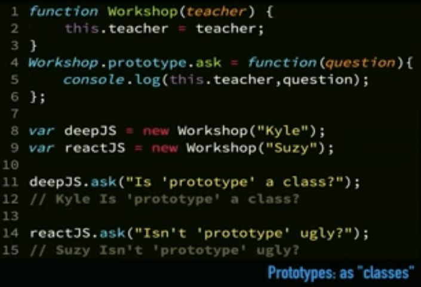
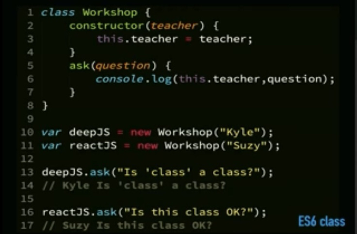

# javascript-exercises

## Exercícios do curso de Javascript do Kyle Simpson

## Link para slides da aula:
- https://static.frontendmasters.com/resources/2019-05-08-getting-into-javascript/getting-into-javascript.pdf

# Três Pilares essenciais do Javascript:
- 1. Types / Coercion
- 2. Scope / Closures
- 3. this / Prototypes

## Anotações pessoais:
- null == undefined => TRUE / null === undefined => FALSE

### IIFE:
- cobrir a função com outra função
- colocar ela toda dentro de parenteses e acabar ela com ()
- serve para proteger as variáveis alteradas na função de afetar o escopo global 
- ps: hoje em dia, em vez de fazer isso é só declarar a variável na função como let
isso se chama block scoping

### closure 
- dificil de entender na teoria, mas na prática parece algo fácil de usar
- segundo tutorial do youtube:
- closure é basicamente acessar variáveis do escopo global dentro da sua função
o dificil:
- aparentemente closure é muito usada quando se invoca uma função dentro de uma função em que a última função se utiliza de uma variável que foi passada como parâmetro na primeira
- em js o filho tem acesso ao que ta no escopo dos pais
- função filho dentro da função pai acessa os parâmetros e variáveis declarados pelo pai, ainda que ele não as passe como parâmetro

### this.
- o .this é definido não pela função, mas pela forma que ela é chamada
- ex: workshop.ask(question)
- dentro da função ask, o .this é o workshop, pq foi como ela foi invocada
- mas pode ser outra coisa dado outro contexto

### prototypes


- isso aqui é basicamente o que eu fiz no FG
- o ask em cada chamada da função ai vai chamar o método lá da classe Workshop
- leia aqui o this.algo como   deepJS.algo / reactJS.algo
- então quando ele sobe la pro ask vc pensa "mas o deepJS não tem um teacher"
- mas repare na classe Workshop que ela da o teacher pra todos daquela classe usando this.teacher = teacher
- ou seja, quando deepJS recebe Workshop("Kyle") ele faz o seguinte:
```
Workshop("Kyle") {
deepJS.teacher = "Kyle"
}
```
- assim, quando vc faz deepJS.ask("blabla") vc ta fazendo o seguinte:
```
function("blabla") {
console.log(deepJS.teacher, "blabla")
}
```
- lembrando que deepJS.teacher = teacher, que é justamente o parâmetro passado quando se declarou essa função
- teacher é só o nome do parametro, ou seja, "Kyle"

o mesmo código, mas agora usando a sintaxe Class



- pra isso que se usa o constructor!
- o constructor é a mesma coisa que a workshop function na imagem anterior